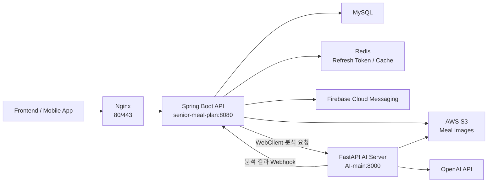

# Senior Meal Plan

Senior Meal Plan은 고령자를 위한 식사 기록 기반 맞춤형 식단 관리 및 리포트 서비스입니다. 사용자가 식사 이미지를 업로드하면 Spring Boot 백엔드가 식사 기록을 저장하고, FastAPI 분석 서버와 연동해 식사 분석 결과, 일간/주간 영양 리포트, 건강 목표 기반 레시피 추천 기능을 제공합니다.

이 저장소는 Spring Boot 백엔드, FastAPI 분석 서버, Docker/Nginx 배포 구성을 함께 포함합니다. FastAPI 분석 서버 자체는 팀원이 담당했으며, 본인은 AI 서버 연동을 포함한 Spring Boot 백엔드 및 배포 환경을 담당했습니다.

## 프로젝트 범위

- 개발 기간: 2025.11.17 ~ 2025.12.11, 커밋 기준
- Spring Boot 코드 규모: Java 파일 149개, 약 6.7k 라인
- 주요 담당 범위: Spring Boot REST API, MySQL/JPA 도메인 설계, JWT 인증, Redis 기반 Refresh Token 관리, Kakao OAuth2 연동, S3 이미지 업로드, AI 서버 연동 인터페이스, 리포트 스케줄러, Redis 캐시, FCM 알림, Docker Compose/Nginx/Certbot 배포 구성

## 주요 기능

- 회원가입, 로그인, JWT Access/Refresh Token 발급 및 갱신
- Kakao OAuth2 로그인 및 앱 딥링크 리다이렉트 처리
- 사용자 프로필, 건강 목표, 알러젠 정보 관리
- AWS S3 Pre-signed URL 기반 식사 이미지 업로드
- 식사 기록 등록 후 AI 서버 분석 요청 및 분석 결과 웹훅 수신
- 식사별 리포트, 일간 리포트, 주간 리포트 조회
- 일간/주간 리포트 생성을 위한 스케줄러 기반 배치 처리
- 사용자 건강 목표와 알러젠을 반영한 레시피 추천 및 북마크
- Redis 캐시를 활용한 사용자 정보/식사 조회 최적화
- Firebase Cloud Messaging 기반 식사 기록 리마인더

## 팀 구성 및 담당 역할

| 구분 | 담당자 | 담당 |
| --- | --- | --- |
| 프론트엔드 | 부김은, 안중혁 | 클라이언트 UI, 사용자 플로우, API 연동 |
| Spring Boot 백엔드 | 신동운 | REST API, DB 연동, 인증/인가, 파일 업로드, AI 서버 연동 인터페이스, 리포트/추천/알림 API, 배포 환경 |
| FastAPI 분석 서버 | 염정윤 | 식사 이미지 분석, 일간/주간 리포트 분석 로직, OpenAI API 연동 |

## 기술 스택

| 영역 | 기술 |
| --- | --- |
| Backend | Java 17, Spring Boot 3.5.6, Spring Security, Spring Data JPA, Spring Validation |
| API/연동 | REST API, WebClient, Springdoc OpenAPI |
| Database/Cache | MySQL, Redis, Spring Cache |
| Auth | JWT, Refresh Token Rotation, Kakao OAuth2 |
| Storage/Notification | AWS S3, Firebase Admin SDK, FCM |
| AI Server | FastAPI, Python, OpenAI API, LangChain |
| Infra | Docker, Docker Compose, Nginx, Certbot |

## 시스템 구조



식사 이미지 업로드는 클라이언트가 Spring Boot API에서 Pre-signed URL을 발급받은 뒤 S3에 직접 업로드하는 흐름입니다. 업로드 완료 후 식사 메타데이터를 등록하면 Spring Boot가 식사와 Pending 리포트를 저장하고, 트랜잭션 커밋 이후 FastAPI 서버에 분석 요청을 보냅니다. 분석이 끝나면 FastAPI 서버가 Spring Boot 웹훅으로 결과를 전달하고, Spring Boot가 식사/영양/리포트 데이터를 갱신합니다.

## 프로젝트 디렉터리 구조

```text
.
├── senior-meal-plan/              # Spring Boot 백엔드
│   ├── src/main/java/.../config    # Security, JWT, S3, FCM, WebClient 설정
│   ├── src/main/java/.../controller
│   │   ├── aiServerCon            # AI 분석 결과 웹훅
│   │   ├── meal                   # 식사 등록/조회
│   │   ├── recipe                 # 추천 레시피/북마크
│   │   └── report                 # 식사/일간/주간 리포트
│   ├── src/main/java/.../domain    # User, Meal, Food, Report, Recipe 도메인
│   ├── src/main/java/.../repository
│   ├── src/main/java/.../service
│   │   ├── orchestration          # 업로드, 리포트 생성, AI 서버 연동 흐름
│   │   ├── report
│   │   ├── recipe
│   │   ├── user
│   │   └── fcm
│   ├── Dockerfile
│   └── build.gradle
├── AI-main/                        # FastAPI 분석 서버, 팀원 담당
│   ├── controller/app.py           # 분석 요청 엔드포인트
│   ├── service/                    # 식사/일간/주간 분석 로직
│   └── Dockerfile
├── infra/
│   ├── docker-compose.yml          # 운영 배포 구성
│   └── docker-compose-local.yml    # 로컬 Docker 실행 구성
└── nginx/
    ├── nginx.conf                  # HTTPS 운영 프록시
    └── nginx-local.conf            # 로컬 HTTP 프록시
```

## 환경변수 설정

실제 secret 값은 저장소에 커밋하지 않습니다. 예제 파일을 복사한 뒤 각 환경에 맞게 값을 채워 실행합니다.

```bash
cp senior-meal-plan/.env.example senior-meal-plan/.env
cp AI-main/.env.example AI-main/.env
```

Spring Boot의 `jwt.secret`은 Base64로 인코딩된 256비트 이상 키를 사용합니다.

```bash
openssl rand -base64 32
```

Firebase Admin SDK 서비스 계정 파일은 `senior-meal-plan/src/main/resources/firebase-adminsdk.json` 위치에 두면 됩니다. 이 파일은 `.gitignore`에 포함되어 있어 저장소에 올라가지 않도록 관리합니다.

환경별 URL 예시는 다음처럼 조정합니다.

| 실행 방식 | Spring에서 FastAPI 호출 | FastAPI에서 Spring 웹훅 호출 | Redis host |
| --- | --- | --- | --- |
| 로컬 직접 실행 | `http://localhost:8000/...` | `http://localhost:8080` | `localhost` |
| Docker Compose | `http://fastapi-app:8000/...` | `http://spring-app:8080` | `redis` |

MySQL은 현재 Docker Compose에 포함되어 있지 않으므로 로컬 MySQL, 별도 MySQL 컨테이너, RDS 같은 외부 DB 주소를 `RDB.local`에 설정해야 합니다.

## 빌드 방법

Spring Boot 백엔드:

```bash
cd senior-meal-plan
./gradlew clean bootJar -x test
```

Docker 이미지 빌드는 `infra` 디렉터리의 Compose 파일을 통해 Spring Boot와 FastAPI 서버를 함께 빌드합니다.

```bash
cd infra
docker compose -f docker-compose-local.yml build
```

## 실행 방법

### 1. 로컬에서 직접 실행

MySQL과 Redis를 먼저 실행한 뒤 FastAPI 서버와 Spring Boot 서버를 실행합니다.

```bash
cd AI-main
python3 -m venv .venv
source .venv/bin/activate
pip install -r requirements.txt
uvicorn controller.app:app --host 0.0.0.0 --port 8000
```

다른 터미널에서 Spring Boot를 실행합니다.

```bash
cd senior-meal-plan
./gradlew bootRun
```

Spring Boot API는 기본적으로 `http://localhost:8080`에서 실행됩니다. Swagger UI는 Springdoc 설정을 통해 `/swagger-ui/index.html` 경로에서 확인할 수 있습니다.

### 2. Docker Compose로 실행

로컬 Docker 구성은 Nginx, Spring Boot, FastAPI, Redis를 함께 실행합니다. MySQL은 별도로 준비해야 합니다.

```bash
cd infra
docker compose -f docker-compose-local.yml up --build
```

로컬 Nginx는 `http://localhost` 요청을 Spring Boot 컨테이너로 프록시합니다.

## 배포 구성

운영 배포는 `infra/docker-compose.yml` 기준으로 다음 서비스를 구성합니다.

- `nginx`: 80/443 포트 수신, HTTPS 리다이렉트, Spring Boot 프록시
- `certbot`: Let's Encrypt 인증서 발급/갱신용 컨테이너
- `spring-app`: Spring Boot API 서버, `senior-meal-plan/.env` 사용
- `fastapi-app`: FastAPI 분석 서버, `AI-main/.env` 사용
- `redis`: Refresh Token 저장소 및 Spring Cache 백엔드

운영 Nginx 설정은 `senior-meal-plan.cloud`, `www.senior-meal-plan.cloud` 도메인과 Certbot 인증서 경로를 기준으로 작성되어 있습니다. 인증서가 준비된 환경에서는 다음 명령으로 컨테이너를 실행합니다.

```bash
cd infra
docker compose -f docker-compose.yml up -d --build
```

## 주요 구현 내용

### 인증과 사용자 관리

- `Spring Security` 기반 stateless 인증 구성을 적용했습니다.
- 로그인 시 Access Token과 Refresh Token을 발급하고, Refresh Token은 `RT:{userId}` 키로 Redis에 저장합니다.
- `/api/auth/refresh`에서 Refresh Token의 JWT 유효성뿐 아니라 Redis 저장 값과의 일치 여부를 확인한 뒤 새 Access/Refresh Token을 발급합니다.
- Kakao OAuth2 로그인 성공 시 사용자 정보를 조회/생성하고, 토큰 발급 후 `seniormeal://oauth/callback` 앱 딥링크로 리다이렉트합니다.

### 식사 이미지 업로드와 분석 연동

- `/v1/user/me/uploads`에서 5분 유효한 S3 PUT Pre-signed URL을 발급합니다.
- 클라이언트가 S3에 이미지를 직접 업로드한 뒤 `/v1/user/me/meal-reports`로 식사 정보를 등록합니다.
- 식사 저장 시 Pending 상태의 식사 리포트를 만들고, 커밋 이후 FastAPI 분석 서버에 분석 요청을 전달합니다.
- `/api/v1/webhooks/meals/analysis-result` 웹훅으로 분석 결과를 받아 식사, 음식 영양 정보, 식사 리포트를 갱신합니다.

### 일간/주간 리포트

- 매일 01:00에 전날 식사 기록이 있는 사용자를 대상으로 일간 리포트 Pending 데이터를 생성합니다.
- 매주 월요일 04:00에 지난주 식사 기록과 일간 리포트를 기반으로 주간 리포트 Pending 데이터를 생성합니다.
- 생성된 배치 데이터는 WebClient를 통해 FastAPI 서버로 전달하고, FastAPI 서버는 분석 완료 후 Spring Boot 웹훅으로 결과를 반환합니다.
- 주간 분석 결과를 반영해 AI 추천 건강 목표와 주간 추천 레시피를 갱신합니다.

### 추천, 캐시, 알림

- 사용자의 건강 목표와 알러젠 조건을 조합해 레시피 추천 후보를 조회하고, 북마크 추가/삭제 API를 제공합니다.
- `whoAmI`, 날짜별 식사 목록, 오늘 식사 목록 등에 Redis 기반 Spring Cache를 적용하고 식사 변경 시 관련 캐시를 무효화합니다.
- 매일 14:00에 점심 식사 기록이 없는 사용자의 FCM 토큰을 조회해 식사 기록 리마인더를 발송합니다.
